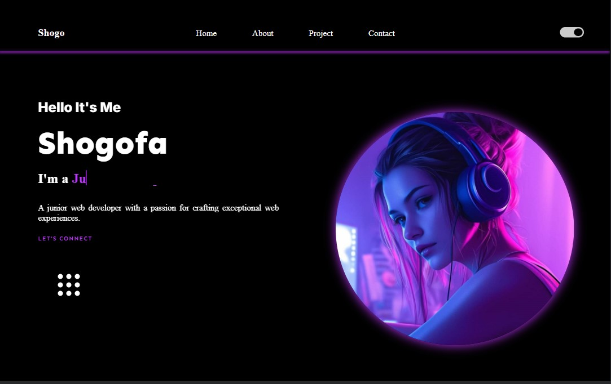
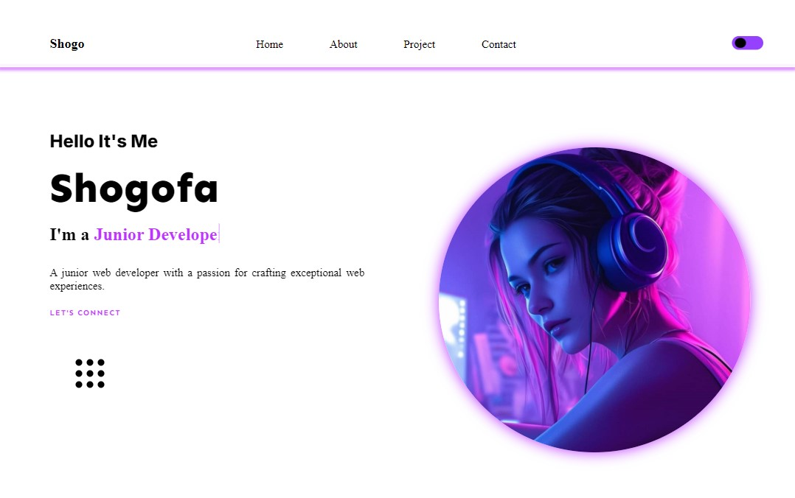

# JavaScript-Capstone-Portfolio 🚀

## Project Overview 📝

### 🛒 **JavaScript-Capstone-Portfolio** 🕵️‍♂️✨

The **JavaScript-Capstone-Portfolio** is the final project for my JavaScript course, showcasing an interactive personal web portfolio. This project leverages JavaScript, HTML, and CSS to highlight my front-end development skills, projects, and achievements with a professional and engaging design. Explore the repository to see my development approach and feel free to provide any feedback!

## Live Demo 🌐

View the live demo of the project [here](https://shogof.github.io/JavaScript-Capstone-project-Portfolio/).

## Demo 📸




## Technologies Used 🛠️

This project is built using the following technologies:

- [**HTML**](https://developer.mozilla.org/en-US/docs/Web/HTML) – The standard markup language for creating web pages.
- [**CSS**](https://developer.mozilla.org/en-US/docs/Web/CSS) – The style sheet language used for describing the presentation of web pages.
- [**JavaScript**](https://developer.mozilla.org/en-US/docs/Web/JavaScript) – The programming language that enables interactive web features.

## Features 🚀

### Current Features

- **Professional Design:** A clean and modern layout to showcase your projects, skills, and achievements.
- **Interactive Elements:** Engaging features like animations and interactive sections.
- **Responsive Layout:** Optimized for various devices and screen sizes to ensure a great user experience.

### Future Improvements

- **Enhanced Interactivity:** Adding more interactive features and animations.
- **Detailed Case Studies:** Expanding the portfolio to include comprehensive case studies of past projects.
- **Contact Form:** Integrating a contact form for direct inquiries and feedback.

## Installation 💻

To get started with this project, follow these steps:

1. **Clone the repository:**

   ```bash
   git clone git@github.com:shogof/js-Capstone-Project-Portfolio.git
   ```

2. **Navigate to the project directory:**

   ```bash
   cd js-Capstone-Project-Portfolio
   ```

3. **Open the HTML file:**
   Open `index.html` in your preferred web browser. You can do this by double-clicking the file or using a command-line tool such as `open` (macOS) or `start` (Windows).

4. **Explore the documentation:**
   Once the HTML file is opened, you will have access to the technical documentation. Use the sidebar navigation or scroll through the content to explore various topics.

5. **Modify as needed:**
   Feel free to customize the documentation page or add your own content by editing the HTML and CSS files in your preferred text editor.

6. **Share and Contribute:**
   If you find this project useful, consider sharing it with others. You are also welcome to contribute by submitting bug reports, feature requests, or pull requests to enhance the project.

## Contributing 🤝

Thank you for considering contributing to this project! Community contributions are essential for the project's growth and improvement.

### How to Contribute

To contribute to this project, please follow these steps:

1. **Fork the repository:**
   Fork the repository to your own GitHub account.

2. **Clone the repository:**
   Clone the repository to your local machine.

   ```bash
   git clone https://github.com/Shegofa/js-Capstone-Project-Portfolio.git
   ```

3. **Create a new branch:**
   Create a new branch for your changes with a descriptive name.

   ```bash
   git checkout -b feature/new-feature
   ```

4. **Make your changes:**
   Implement your changes in the new branch. Ensure that your modifications adhere to the project's coding conventions and style guidelines.

5. **Commit your changes:**
   Commit your changes with clear and descriptive commit messages.

   ```bash
   git commit -a -m 'Add new feature'
   ```

6. **Push your changes:**
   Push your changes to your forked repository on GitHub.

   ```bash
   git push origin feature/new-feature
   ```

7. **Submit a pull request:**
   Open a pull request from your branch to the main repository to propose your changes.

   - Go to the [original repository](https://github.com/shogof/JavaScript-Capstone-project-Portfolio).
   - Click on the "Pull Requests" tab.
   - Click on "New Pull Request" and select your branch.
   - Provide a clear description of the changes you made and submit the pull request.

## Acknowledgments 🙏

This project was designed with the help of talented designers who provided the Figma design. I would like to give special thanks to them for their amazing work:

- [Sara Ebadi](https://www.linkedin.com/in/designername1)

- [Hasina Nasiry](https://www.linkedin.com/in/designername2)

- [Sohaila Sarwari](https://www.linkedin.com/in/sohaila-sarwari-660555218?utm_source=share&utm_campaign=share_via&utm_content=profile&utm_medium=android_app)

- [Mahboba Qarizada LinkedIn](https://www.linkedin.com/in/designername4)

Thank you for your exceptional design work and creativity!

## License 📜

This project is licensed under the [MIT License](https://opensource.org/licenses/MIT). See the [LICENSE](LICENSE) file for more details.

## Contact Me 📬

If you have any questions, suggestions, or feedback, feel free to reach out to me!

- **LinkedIn:** [Shegofa Developer](https://www.linkedin.com/in/shegofa-developer-aa362030b)
- **Email:** [shogofadeveloper12@gmail.com](mailto:shogofadeveloper12@gmail.com)
- **GitHub:** [GitHub Profile](https://github.com/shogof)
- **WhatsApp:** [+93731905950](https://wa.me/+93731905950)
